DD HS
================
LBE
23/05/2022

\#workspace setup

\#THEMES

``` r
# paper theme
theme_DDHS <- theme_classic()+
    theme(panel.border = element_rect(size=1, fill=NA),
          axis.text = element_text(family="Arial", size = 12),
          axis.title = element_text(family="Arial", size = 12),
          title = element_text(family = "Arial",  size = 12),
          plot.title = element_text(hjust = 0.5, vjust = 1))
```

    ## Warning: The `size` argument of `element_rect()` is deprecated as of ggplot2 3.4.0.
    ## ℹ Please use the `linewidth` argument instead.
    ## This warning is displayed once every 8 hours.
    ## Call `lifecycle::last_lifecycle_warnings()` to see where this warning was
    ## generated.

``` r
 cols_= c("#F7444E", "#78BCC4")
```

\#SURVEYS

\##data

``` r
crest_surveys <- read_csv("./data/surveys_RAW.csv") %>% 
  dplyr::select(2:ncol(.))
```

    ## New names:
    ## Rows: 379 Columns: 18
    ## ── Column specification
    ## ──────────────────────────────────────────────────────── Delimiter: "," chr
    ## (4): Date, Code, Transect, type dbl (14): ...1, adult, juv, col_m2, uo_DC,
    ## o_DC, DC, uo_LC, o_LC, LC, COTS, ...
    ## ℹ Use `spec()` to retrieve the full column specification for this data. ℹ
    ## Specify the column types or set `show_col_types = FALSE` to quiet this message.
    ## • `` -> `...1`

``` r
#density data

crest_density <- crest_surveys %>% 
  mutate(prop_DC = (DC/(DC+LC)),
         prop_LC = (LC/(DC+LC)),
         dens_PM = (as.numeric(adult)+juv)/col_m2,
         dens_adult = as.numeric(adult)/col_m2)
  
  crest_summary <- crest_density %>% 
    group_by(type) %>% 
    summarise(n=length(dens_PM),
              n_transect = length(unique(Code)),
              mean_25 = mean(dens_PM[prop_DC<=0.25]),
              mean_75 = mean(dens_PM[prop_DC>=0.75]),
              SEM_25 = sd(dens_PM[prop_DC<=0.25])/sqrt(length(dens_PM[prop_DC<=0.25])),
              SEM_75 = sd(dens_PM[prop_DC>=0.75])/sqrt(length(dens_PM[prop_DC>=0.75])))

  #summary coral data
crest_transects <- crest_density %>% 
  dplyr::select(2, 8:18) %>% 
  distinct() %>% 
  mutate(LCC = LC/100,
         DCC = DC/100,
         prop_o_LC = replace_na(o_LC/(LC+DC),0),
         prop_o_DC = replace_na(o_DC/(DC+LC),0)) %>% 
  dplyr::select(9:10,12,15:16) %>% 
  pivot_longer(names_to = "type",values_to = "prop.occ", cols = 4:5 ) %>% 
  mutate(type = recode(type, "prop_o_DC" = "Dead",
                "prop_o_LC" = "Live")) 

#only occupied corals

occ_transects <- crest_density %>% 
  filter(adult>0) %>% 
  dplyr::group_by(Code, prop_DC) %>% 
  dplyr::mutate(ttl_occ = length(Code)) %>% 
  ungroup() %>% 
  dplyr::group_by(Code, type, prop_DC) %>% 
 dplyr::summarise(occ_freq = length(Code),
                  oc_prop = occ_freq/ttl_occ) %>% 
  distinct()
```

    ## Warning: Returning more (or less) than 1 row per `summarise()` group was deprecated in
    ## dplyr 1.1.0.
    ## ℹ Please use `reframe()` instead.
    ## ℹ When switching from `summarise()` to `reframe()`, remember that `reframe()`
    ##   always returns an ungrouped data frame and adjust accordingly.
    ## Call `lifecycle::last_lifecycle_warnings()` to see where this warning was
    ## generated.

    ## `summarise()` has grouped output by 'Code', 'type', 'prop_DC'. You can override
    ## using the `.groups` argument.

``` r
occ_summary <- occ_transects %>% 
    group_by(type) %>% 
    summarise(n=length(oc_prop))
```

\#analysis

``` r
dens.lm <- lm(log(dens_PM)~prop_DC*type, data = crest_density)

summary(dens.lm)
```

    ## 
    ## Call:
    ## lm(formula = log(dens_PM) ~ prop_DC * type, data = crest_density)
    ## 
    ## Residuals:
    ##      Min       1Q   Median       3Q      Max 
    ## -2.60909 -0.50904  0.04035  0.55244  2.02850 
    ## 
    ## Coefficients:
    ##                  Estimate Std. Error t value Pr(>|t|)    
    ## (Intercept)        3.4716     0.3729   9.311   <2e-16 ***
    ## prop_DC           -0.5122     0.5310  -0.965   0.3354    
    ## typeLive           0.1290     0.3802   0.339   0.7346    
    ## prop_DC:typeLive   1.4079     0.5562   2.531   0.0118 *  
    ## ---
    ## Signif. codes:  0 '***' 0.001 '**' 0.01 '*' 0.05 '.' 0.1 ' ' 1
    ## 
    ## Residual standard error: 0.8146 on 375 degrees of freedom
    ## Multiple R-squared:  0.1763, Adjusted R-squared:  0.1697 
    ## F-statistic: 26.75 on 3 and 375 DF,  p-value: 1.061e-15

``` r
plot(dens.lm)
```

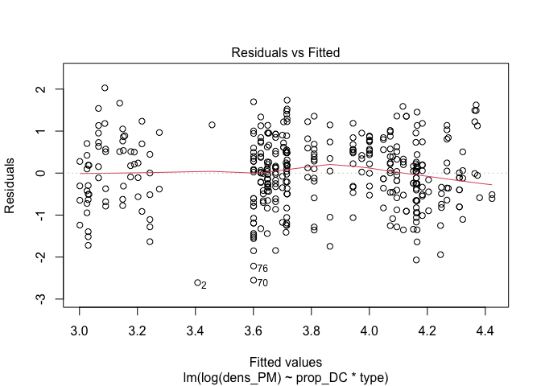<!-- -->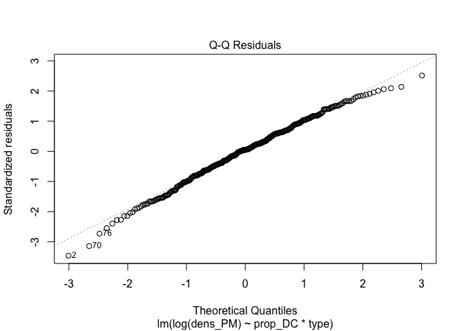<!-- --><!-- -->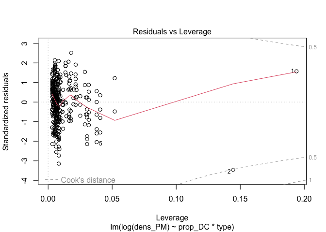<!-- -->

``` r
library(broom)
model.diag.metrics <- augment(dens.lm)
model.diag.metrics %>%
  top_n(3, wt = .cooksd)
```

    ## # A tibble: 3 × 9
    ##   `log(dens_PM)` prop_DC type  .fitted .resid   .hat .sigma .cooksd .std.resid
    ##            <dbl>   <dbl> <chr>   <dbl>  <dbl>  <dbl>  <dbl>   <dbl>      <dbl>
    ## 1          4.61   0.0278 Dead     3.46   1.15 0.194   0.813  0.148        1.57
    ## 2          0.799  0.125  Dead     3.41  -2.61 0.144   0.803  0.506       -3.46
    ## 3          1.61   0.446  Dead     3.24  -1.63 0.0379  0.811  0.0412      -2.04

\#Q1 - DD HS? **Is there evidence for DD habitat selection on natural
reefs, and is this influenced by the health of the colony you’re on?**  
*YES* There is a significant relationship between the density of
moluccensis on coral colonies and the proportion dead coral on a
transect, and the slope of this relationship differs depending on
whether the coral colony is live or dead (two-way anova, interaction
term t=2.5, df(3,375), p=0.01). Adjusted R-squared: 0.1697

\##figure

``` r
#density @ colony level
(dens_adult <- ggplot(data =  crest_density, aes(x=prop_DC, y = dens_adult, fill = type,  group = type))+
  geom_point(size = 3, alpha = 0.5, shape = 21, aes(fill = type))+
   stat_smooth(method = "lm", colour="black", size = 0.5, alpha =0.3, show.legend = F)+ #linear
    # stat_smooth(method = "lm", formula = y ~ x + I(x^2), size = 1)+ #quadratic
    # stat_smooth(method = "loess")+ #even loess is straight, ha!
  scale_fill_manual(values = cols_)+
  scale_colour_manual(values = cols_)+
  labs(y = expression(Adult~density~m^-2), x = "")+
  scale_y_continuous(limits = c(0,450),  expand = c(0,20))+
  # facet_wrap(~period)+
  theme_DDHS+
  theme(legend.position = c(0.15,0.85),
        legend.title = element_blank()))
```

    ## Warning: Using `size` aesthetic for lines was deprecated in ggplot2 3.4.0.
    ## ℹ Please use `linewidth` instead.
    ## This warning is displayed once every 8 hours.
    ## Call `lifecycle::last_lifecycle_warnings()` to see where this warning was
    ## generated.

    ## `geom_smooth()` using formula = 'y ~ x'

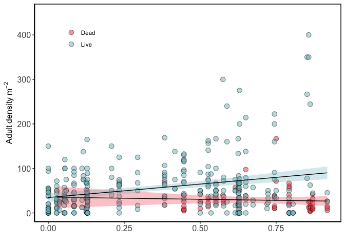<!-- -->

``` r
#prop occupied @ transect level - by all colonies
(prop_occupied <- ggplot(data = crest_transects, aes(x=prop_DC, y=prop.occ, fill= type,  group=type) )+
  geom_point(size = 3, alpha = 0.5, shape = 21, aes(fill = type))+
  stat_smooth(method = "lm",  size = 0.5, colour = "black", alpha = 0.3, show.legend = F)+
  scale_fill_manual(values = cols_)+
  scale_colour_manual(values = cols_)+
  labs(y = "Proportion occupied overall", x = "")+
   scale_y_continuous(expand = c(0,0.01))+
  theme_DDHS+
  theme(legend.position = "none"))
```

    ## `geom_smooth()` using formula = 'y ~ x'

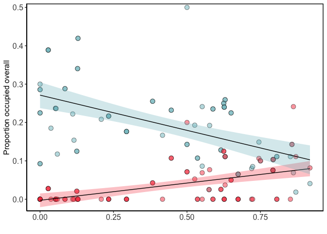<!-- -->

``` r
# fig_2 <- ggarrange(dens_adult, prop_occupied, nrow=1, align = "v", labels = c("a", "b"))
  # annotate_figure(fig_2, bottom = "Proportion dead coral (transect)")

# ggsave("./figures/Figure.2.jpg", height = 10, width = 20, units = "cm")
```

\##change point analysis

``` r
library(mcp)

#define a priori model
model = list(
  dens_adult ~ 1 + prop_DC,  #intercept & slope
   ~ 0 + prop_DC + I(prop_DC^2) #quadratic
)

model = list(
  dens_adult ~ 1 + prop_DC,  #intercept & slope
   ~ 0 + prop_DC  #different slope?
)

model = list(
  dens_adult ~ 1 + prop_DC,  #intercept & slope
   ~ sigma(0 + prop_DC)  #different variance?
)

fit = mcp::mcp(model, subset(crest_density, type=="Live"))
```

    ## Compiling model graph
    ##    Resolving undeclared variables
    ##    Allocating nodes
    ## Graph information:
    ##    Observed stochastic nodes: 315
    ##    Unobserved stochastic nodes: 6
    ##    Total graph size: 1571
    ## 
    ## Initializing model

    ## Finished sampling in 11.2 seconds

``` r
plot(fit, q_predict = T)+
  theme_classic()+
  labs(y = "density m2", x = "proportion dead coral (transect)")
```

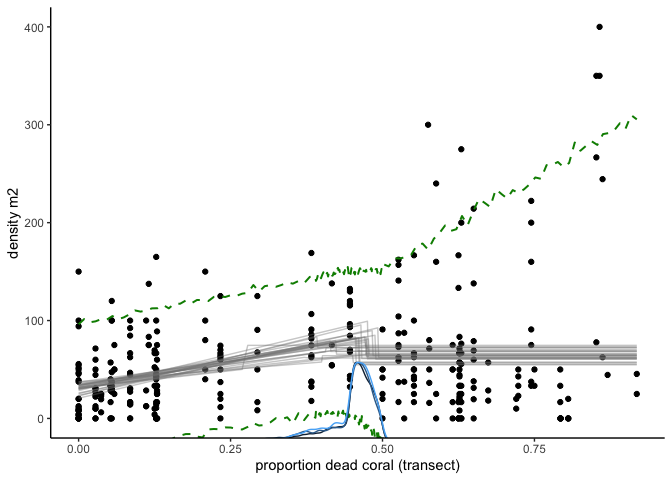<!-- -->

``` r
# ggsave("./figures/S1.png", width = 15, height = 10, units = "cm" )

print(fit$prior)
```

    ## List of 6
    ##  $ cp_1           :"dunif(MINX, MAXX)"
    ##  $ int_1          :"dt(0, 3 * SDY, 3)"
    ##  $ int_2          :"dt(0, 3 * SDY, 3)"
    ##  $ prop_DC_1      :"dt(0, SDY / (MAXX - MINX), 3)"
    ##  $ sigma_1        :"dnorm(0, SDY) T(0, )"
    ##  $ sigma_prop_DC_2:"dt(0, SDY / (MAXX - MINX), 3)"

``` r
summary(fit)
```

    ## Family: gaussian(link = 'identity')
    ## Iterations: 9000 from 3 chains.
    ## Segments:
    ##   1: dens_adult ~ 1 + prop_DC
    ##   2: dens_adult ~ 1 ~ sigma(0 + prop_DC)
    ## 
    ## Population-level parameters:
    ##             name   mean  lower upper Rhat n.eff
    ##             cp_1   0.45   0.36   0.5    1   551
    ##            int_1  30.09  22.58  37.4    1  1518
    ##            int_2  66.44  54.28  77.9    1  2029
    ##        prop_DC_1 111.83  65.42 154.5    1  1063
    ##          sigma_1  34.87  31.34  38.6    1  3382
    ##  sigma_prop_DC_2 192.20 118.91 267.9    1   846

``` r
plot_pars(fit, regex_pars = "sigma_")
```

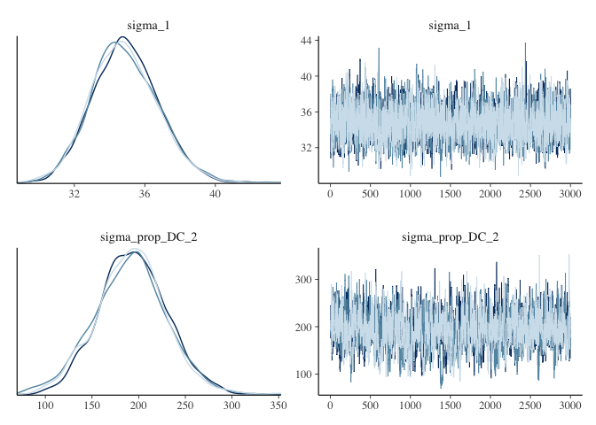<!-- -->

\#Q2 - Ecological trap? **Does the presence of adults influence the
habitat choice of juveniles, and does this effect differ depending on
the identity of the coral colony?**

Yes, juveniles are more likely to recruit to a dead coral if there are
adults present, sig interaction p\<0.0001, Adj R2 = 0.74, F-statistic:
138.4 on 4 and 183 DF,

\##Transect level Manlys \###data

``` r
tran_used <- crest_surveys %>% 
  mutate(adult.p = if_else(adult>0, "adult present", "adult absent"),
         ID = str_c(type, adult.p, sep="_")) %>% 
  group_by(Code, ID) %>% 
  summarise(freq=sum(juv2)) %>% 
  pivot_wider(names_from = ID, values_from = freq, values_fill = 0) 
```

    ## `summarise()` has grouped output by 'Code'. You can override using the
    ## `.groups` argument.

``` r
crl.avail <- crest_surveys %>% 
  mutate(adult.p = if_else(adult>0, "adult present", "adult absent"),
         ID = str_c(type, adult.p, sep="_"),
         LC.prop = LC/(LC+DC),
         DC.prop = DC/(LC+DC)) %>% 
  dplyr::select(Code, LC.prop, DC.prop) 

  #calc 
juvs.avail <- tran_used%>%  
  full_join(crl.avail, by="Code") %>% 
  dplyr::mutate("Live_adult present" = LC.prop,
                "Live_adult absent" = LC.prop,
                "Dead_adult present" = DC.prop,
                "Dead_adult absent" = DC.prop) %>% 
  dplyr::select(1:5) %>%
  distinct() %>% 
   column_to_rownames(var = "Code")
  
tran_used <- tran_used %>% 
  column_to_rownames(var = "Code")

library(adehabitatHS)  
```

    ## Loading required package: sp
    ## The legacy packages maptools, rgdal, and rgeos, underpinning this package
    ## will retire shortly. Please refer to R-spatial evolution reports on
    ## https://r-spatial.org/r/2023/05/15/evolution4.html for details.
    ## This package is now running under evolution status 0 
    ## Loading required package: ade4
    ## Loading required package: adehabitatMA
    ## Registered S3 methods overwritten by 'adehabitatMA':
    ##   method                       from
    ##   print.SpatialPixelsDataFrame sp  
    ##   print.SpatialPixels          sp  
    ## Loading required package: adehabitatHR
    ## Loading required package: adehabitatLT
    ## Loading required package: CircStats
    ## Loading required package: MASS
    ## 
    ## Attaching package: 'MASS'
    ## 
    ## The following object is masked from 'package:dplyr':
    ## 
    ##     select
    ## 
    ## Loading required package: boot
    ## 
    ## Attaching package: 'boot'
    ## 
    ## The following object is masked from 'package:mcp':
    ## 
    ##     logit
    ## 
    ## 
    ## Attaching package: 'adehabitatLT'
    ## 
    ## The following object is masked from 'package:dplyr':
    ## 
    ##     id
    ## 
    ## 
    ## Attaching package: 'adehabitatHR'
    ## 
    ## The following object is masked from 'package:mcp':
    ## 
    ##     mcp

``` r
wiRatio <- widesIII(u=tran_used, a=juvs.avail, alpha =0.05)

plot(wiRatio)
```

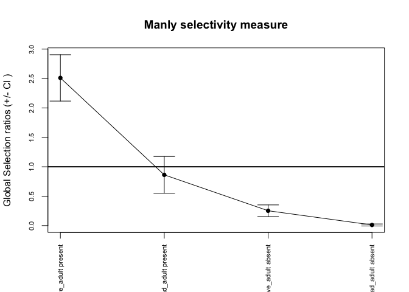<!-- -->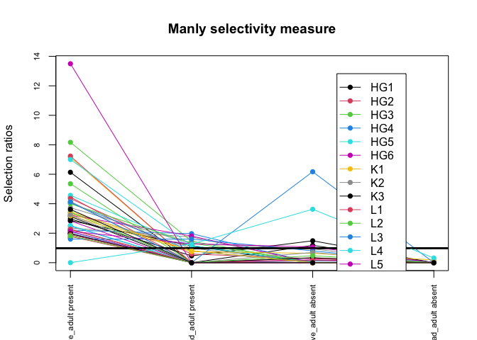<!-- -->

``` r
#extract data
manly_data <- data.frame(wiRatio$wij) %>% 
  rownames_to_column(var = "Code") %>% 
  inner_join(crl.avail, by = "Code") %>% 
  pivot_longer(cols = 2:5, names_to = "type", values_to = "MSC") %>% 
  distinct() %>% 
  mutate(c.type = fct_relevel(str_split(type, "_", simplify = T)[,1], "Dead"),
         adult = str_split(type, "_", simplify = T)[,2]) 
```

\###figure

``` r
#plot it

(eco_trap <- ggplot(data = manly_data, aes(x=DC.prop, y= log(MSC), fill = c.type, shape = adult))+
  stat_smooth(aes(colour = c.type), method = "lm", se = T, size =0.5, show.legend = F)+
  geom_point(size = 3, alpha = 0.8, show.legend = T)+
  scale_shape_manual(values = c(21,22), name = "adults", labels = c("absent", "present"))+
  scale_fill_manual(values = cols_, name = "colony type")+
  geom_abline(intercept = 0, slope = 0, linetype = "dashed")+
  guides(fill = guide_legend(override.aes=list(shape=21)),
         colour = guide_none())+
  labs(x = "Proportion dead coral")+
  theme_classic()+
  annotate("text", label = "preference", x = 0.05, y=0.2)+
  annotate("text", label = "avoidance", x = 0.05, y=-0.2))
```

    ## `geom_smooth()` using formula = 'y ~ x'

    ## Warning: Removed 107 rows containing non-finite values (`stat_smooth()`).

    ## Warning in qt((1 - level)/2, df): NaNs produced

    ## Warning in max(ids, na.rm = TRUE): no non-missing arguments to max; returning
    ## -Inf

    ## Warning: Removed 8 rows containing missing values (`geom_point()`).

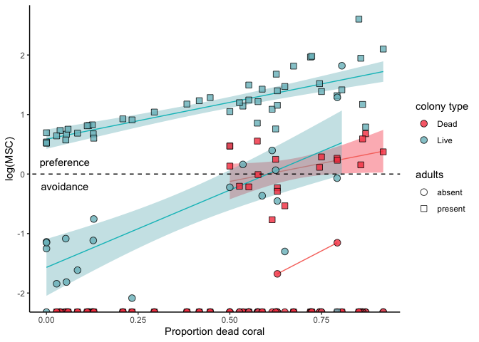<!-- -->

``` r
# ggsave("./figures/Figure 3_V2.jpg", width = 20, height = 15, units="cm")
```

### analysis

``` r
manly_stat <- lm(log(MSC+1)~DC.prop+c.type*adult, data = manly_data)
summary(manly_stat)
```

    ## 
    ## Call:
    ## lm(formula = log(MSC + 1) ~ DC.prop + c.type * adult, data = manly_data)
    ## 
    ## Residuals:
    ##      Min       1Q   Median       3Q      Max 
    ## -1.57309 -0.18826 -0.05328  0.17586  1.57181 
    ## 
    ## Coefficients:
    ##                               Estimate Std. Error t value Pr(>|t|)    
    ## (Intercept)                   -0.23332    0.06358  -3.670 0.000318 ***
    ## DC.prop                        0.49862    0.08310   6.001 1.03e-08 ***
    ## c.typeLive                     0.22996    0.06793   3.385 0.000870 ***
    ## adultadult.present             0.31116    0.06928   4.492 1.25e-05 ***
    ## c.typeLive:adultadult.present  0.86985    0.09595   9.066  < 2e-16 ***
    ## ---
    ## Signif. codes:  0 '***' 0.001 '**' 0.01 '*' 0.05 '.' 0.1 ' ' 1
    ## 
    ## Residual standard error: 0.3286 on 183 degrees of freedom
    ##   (8 observations deleted due to missingness)
    ## Multiple R-squared:  0.7515, Adjusted R-squared:  0.7461 
    ## F-statistic: 138.4 on 4 and 183 DF,  p-value: < 2.2e-16

``` r
plot(manly_stat)
```

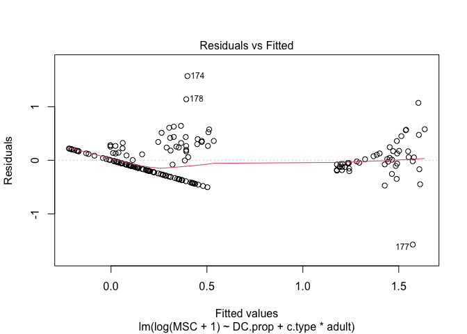<!-- -->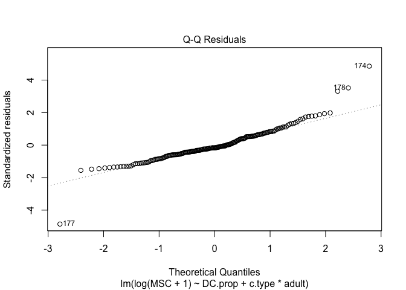<!-- -->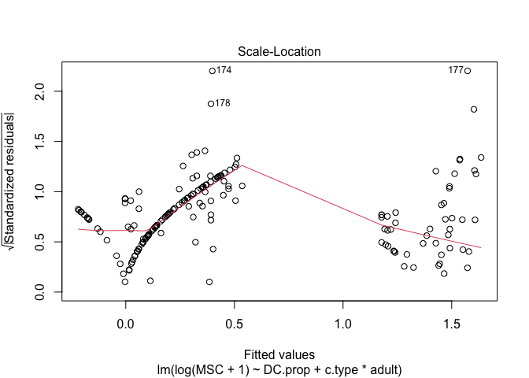<!-- -->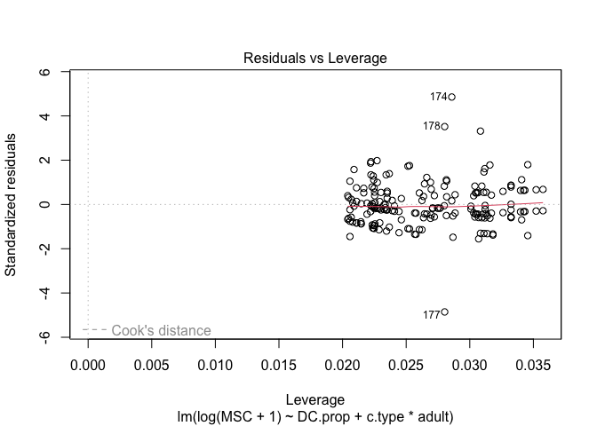<!-- -->
\##Q2b - Demographic consequence

**One of the assumptions of ecological trap is that there has to be a
demonstrated negative demographic consequence of being trapped. So, what
happens to the density of P. mol after 1 year?**

The density of P. mol adults declined by 54% (t1 0.39, t2 0.17), and
juvenils by 17% (t1 0.06, t2 0.04), and this difference is significant
for adutls (adults F = 13.45 (1,87), P\<0.001) , but not for juveniles
(juveniles F = 0.7 (1,87), P=0.4).

\###Data

``` r
T2_raw <- read_csv("./data/surveys_RAW_T2.csv")
```

    ## New names:
    ## Rows: 40 Columns: 7
    ## ── Column specification
    ## ──────────────────────────────────────────────────────── Delimiter: "," chr
    ## (3): Site, Transect, Code dbl (3): ...1, adult, juv date (1): Date
    ## ℹ Use `spec()` to retrieve the full column specification for this data. ℹ
    ## Specify the column types or set `show_col_types = FALSE` to quiet this message.
    ## • `` -> `...1`

\###analysis

``` r
T2_dens <- T2_raw %>%
  dplyr::mutate(adult_den = adult/100,
                juv_den = juv/100) %>% 
  dplyr::mutate(period = "t2") %>% 
  dplyr::select("Code", "adult", "juv", "adult_den", "juv_den", "period")

diff_dens <- crest_surveys %>%
  group_by(Code) %>% 
 mutate( adult = replace_na(as.double(adult), 0)) %>% 
  summarise(adult = sum(adult),
            juv = sum(juv)) %>% 
  dplyr::mutate(adult_den = adult/100,
                juv_den = juv/100) %>% 
  dplyr::mutate(period = "t1") %>% 
  add_row(T2_dens)

#analysis
summary(aov(adult_den~period, data = diff_dens))
```

    ##             Df Sum Sq Mean Sq F value   Pr(>F)    
    ## period       1  1.012  1.0119   13.45 0.000421 ***
    ## Residuals   87  6.545  0.0752                     
    ## ---
    ## Signif. codes:  0 '***' 0.001 '**' 0.01 '*' 0.05 '.' 0.1 ' ' 1

``` r
summary(aov(juv_den~period, data = diff_dens))
```

    ##             Df Sum Sq  Mean Sq F value Pr(>F)
    ## period       1 0.0043 0.004279     0.7  0.405
    ## Residuals   87 0.5319 0.006114

``` r
#summarise
T2_summary <- T2_raw %>%
  dplyr::mutate(adult_den = adult/100,
                juv_den = juv/100) %>% 
   summarise(mean_adult = mean(adult_den),
            SEM_adult = sd(adult_den/sqrt(length(adult_den))),
            mean_juv = mean(juv_den),
            SEM_juv = sd(juv_den/sqrt(length(juv_den)))) %>%
  dplyr::mutate(period = "t2") 

diff_summary <- crest_surveys %>%
  group_by(Code) %>% 
 mutate( adult = replace_na(as.double(adult), 0)) %>% 
  summarise(adult = sum(adult),
            juv = sum(juv)) %>% 
  dplyr::mutate(adult_den = adult/100,
                juv_den = juv/100) %>% 
  summarise(mean_adult = mean(adult_den),
            SEM_adult = sd(adult_den/sqrt(length(adult_den))),
            mean_juv = mean(juv_den),
            SEM_juv = sd(juv_den/sqrt(length(juv_den)))) %>%
  dplyr::mutate(period = "t1") %>% 
  add_row(T2_summary)
```

# Q3 - Experiment

Does DD HS occur? Is it influenced by the identity of the alternate
coral colony, when there is an adult present ( Ie teasing apart cue of
conspecific vs cue from live coral)? **YES, The density of adults on the
established coral colony had a significant effect on the habitat choice
of P. moluccensis juveniles in the habitat selection experiment X2=62.7,
df=2, p\<0.0001**

\###Data

``` r
expt_data <- read_csv("./data/Choice.csv") %>% 
  janitor::clean_names() %>% 
  group_by(treatment, density, code) %>% 
  mutate(n.trials = length(trial)) %>% 
  mutate(treatment = recode(treatment, 
                            "1.Live" = "Live",
                            "2.Degraded" = "Dead"))
```

    ## Rows: 100 Columns: 4
    ## ── Column specification ────────────────────────────────────────────────────────
    ## Delimiter: ","
    ## chr (1): Treatment
    ## dbl (3): Trial, Density, Code
    ## 
    ## ℹ Use `spec()` to retrieve the full column specification for this data.
    ## ℹ Specify the column types or set `show_col_types = FALSE` to quiet this message.

``` r
#for points only

expt_points <- expt_data %>% 
  dplyr::select(2:5) %>% 
  distinct()
```

\###Analysis

``` r
##Test
choice_log=glm(data=expt_data, code~treatment+density, family=binomial(logit))
summary(choice_log)
```

    ## 
    ## Call:
    ## glm(formula = code ~ treatment + density, family = binomial(logit), 
    ##     data = expt_data)
    ## 
    ## Coefficients:
    ##                Estimate Std. Error z value Pr(>|z|)    
    ## (Intercept)   -5.068444   0.973707  -5.205 1.94e-07 ***
    ## treatmentLive  0.861896   0.678419   1.270    0.204    
    ## density        0.012719   0.002794   4.552 5.31e-06 ***
    ## ---
    ## Signif. codes:  0 '***' 0.001 '**' 0.01 '*' 0.05 '.' 0.1 ' ' 1
    ## 
    ## (Dispersion parameter for binomial family taken to be 1)
    ## 
    ##     Null deviance: 125.374  on 99  degrees of freedom
    ## Residual deviance:  62.645  on 97  degrees of freedom
    ## AIC: 68.645
    ## 
    ## Number of Fisher Scoring iterations: 6

``` r
anova(choice_log, test="Chisq")
```

    ## Analysis of Deviance Table
    ## 
    ## Model: binomial, link: logit
    ## 
    ## Response: code
    ## 
    ## Terms added sequentially (first to last)
    ## 
    ## 
    ##           Df Deviance Resid. Df Resid. Dev  Pr(>Chi)    
    ## NULL                         99    125.374              
    ## treatment  1    0.737        98    124.637    0.3907    
    ## density    1   61.992        97     62.645 3.449e-15 ***
    ## ---
    ## Signif. codes:  0 '***' 0.001 '**' 0.01 '*' 0.05 '.' 0.1 ' ' 1

``` r
### Calculating likelihood ratio for appropriate model ####
with (choice_log, null.deviance-deviance)
```

    ## [1] 62.72848

``` r
with (choice_log, df.null-df.residual)
```

    ## [1] 2

``` r
with (choice_log, pchisq(null.deviance - deviance, df.null - df.residual, lower.tail = FALSE))
```

    ## [1] 2.391575e-14

``` r
### Walds Chisq values

wald.test(b = coef(choice_log), Sigma = vcov(choice_log), Terms = 2)
```

    ## Wald test:
    ## ----------
    ## 
    ## Chi-squared test:
    ## X2 = 1.6, df = 1, P(> X2) = 0.2

``` r
wald.test(b = coef(choice_log), Sigma = vcov(choice_log), Terms = 3)
```

    ## Wald test:
    ## ----------
    ## 
    ## Chi-squared test:
    ## X2 = 20.7, df = 1, P(> X2) = 5.3e-06

``` r
##predicting LD50 (for p specific values)

choice_H=glm(data=subset(expt_data, expt_data$treatment=="Live"), code~density, family=binomial(logit)) #subset dataset for each separate model (ie outcomes)
predict_H=(dose.p(choice_H, p=c(0.5, 0.75,0.8, 0.9))) #calculates the "dose" (=y-value) where p (=x-value) equals the numbers you specify

choice_D=glm(data=subset(expt_data, expt_data$treatment=="Dead"), code~density, family=binomial(logit))
predict_D=(dose.p(choice_D, p=c(0.5, 0.75,0.8, 0.9)))

52.69085*1.96 #95%CI Degraded
```

    ## [1] 103.2741

``` r
35.98636*1.96 #95%CI Healthy
```

    ## [1] 70.53327

\###Figure

``` r
(expt_plot <- ggplot(data = expt_data, aes(x=density, y=code ))+
 geom_point(data = expt_points, aes(size = n.trials, fill = treatment), shape = 21,  alpha = 0.5)+
  stat_smooth(method="glm",method.args = list(family = "binomial"), se=T,  size=0.7, aes(fill=treatment, linetype = treatment, colour = treatment))+ 
   scale_fill_manual(values = cols_)+ 
   #LD50 line Live (use values here that you caclculated using dose.p)
geom_segment( aes(y = 0.5, yend = 0.5, xend = 316.8520, x = -Inf),size=0.5, linetype = "dotted") + 
geom_segment( aes(x=316.8520,y=-Inf,xend=316.8520,yend=0.5),size=0.5, linetype = "dotted") +

#LD50 line Dead (use values here that you caclculated using dose.p)
geom_segment( aes(y = 0.5, yend = 0.5, xend = 411.8904,x =316.8520 ),size=0.5,linetype = "dotted") +
geom_segment( aes(x=411.8904, xend=411.8904, yend=0.5,y = -Inf),size=0.5, linetype = "dotted") + 
  labs(x="Density on established colony", y="Colony choice")+
  guides(fill=guide_none(),
         linetype = guide_legend(title="Alternate \ncolony type"),
         colour = guide_legend(title="Alternate \ncolony type", override.aes=list(fill=NA)),
         size = guide_legend(title="Number of \ntrials") )+
  theme_DDHS)
```

    ## `geom_smooth()` using formula = 'y ~ x'

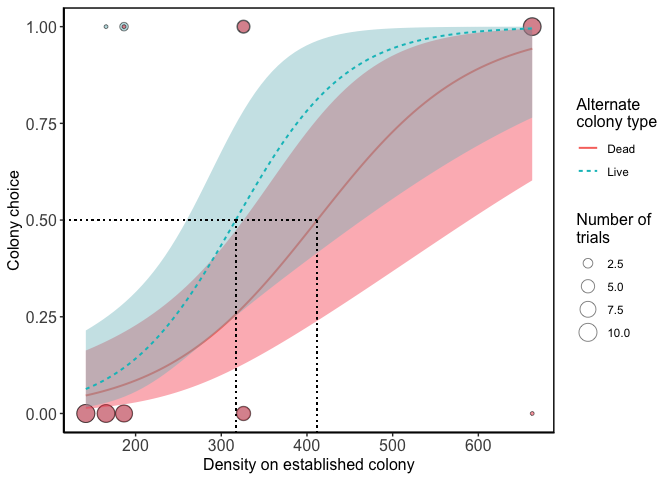<!-- -->

``` r
# ggsave("./figures/Figure 4.svg", width = 15, height = 10, units = "cm")
```
